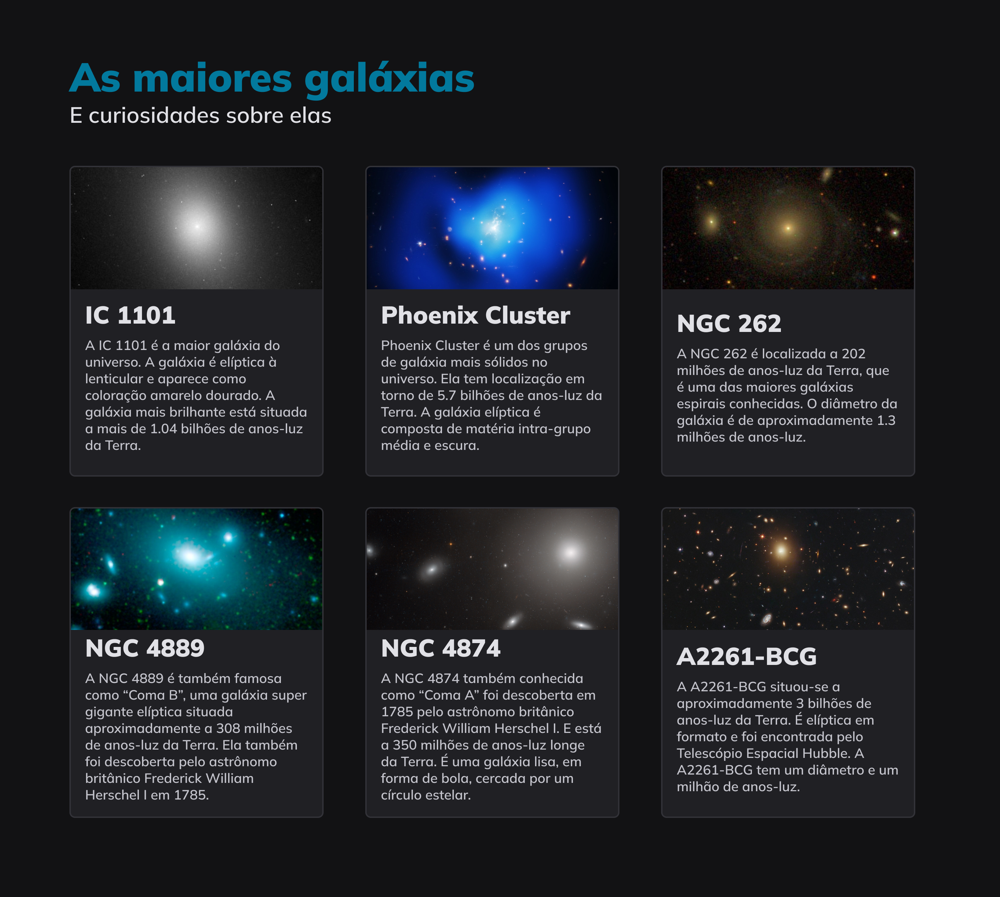

# Explorer Project 6

## Overview

**Explorer Project 6** is a comprehensive learning project designed to dive deep into the world of CSS Grid. This project covers a range of topics including CSS Grid, Template Columns, Template Rows, Grid Column, Grid Row, Grid Template Areas, Gap, Shorthand Grid Template, Alignment of Content and Items, Align Self, and the interplay between Grid and Flex properties.

Inspired by the [Figma project](https://www.figma.com/community/file/1256354736253234634), this repository serves as both a learning resource and a practical implementation guide for these fundamental CSS concepts.

## Preview



_Note: The above image is a snapshot of what you can expect from this project._

## Project Structure

The project is structured as follows:

- **index.html**: The main HTML file.
- **style.css**: The CSS file containing all the styling rules and grid layout definitions.
- **assets/**: A folder containing all the necessary images and additional assets used in the project.

## Cloning and Using the Repository

To clone and use this project on your computer, follow these steps:

1. Open your terminal.
2. Clone the repository using the command:
   ```
   git clone https://github.com/giovannivicentin/explorer-project-6
   ```
3. Navigate to the project directory:
   ```
   cd explorer-project-6
   ```
4. Open the `index.html` file in a web browser to view the project.
